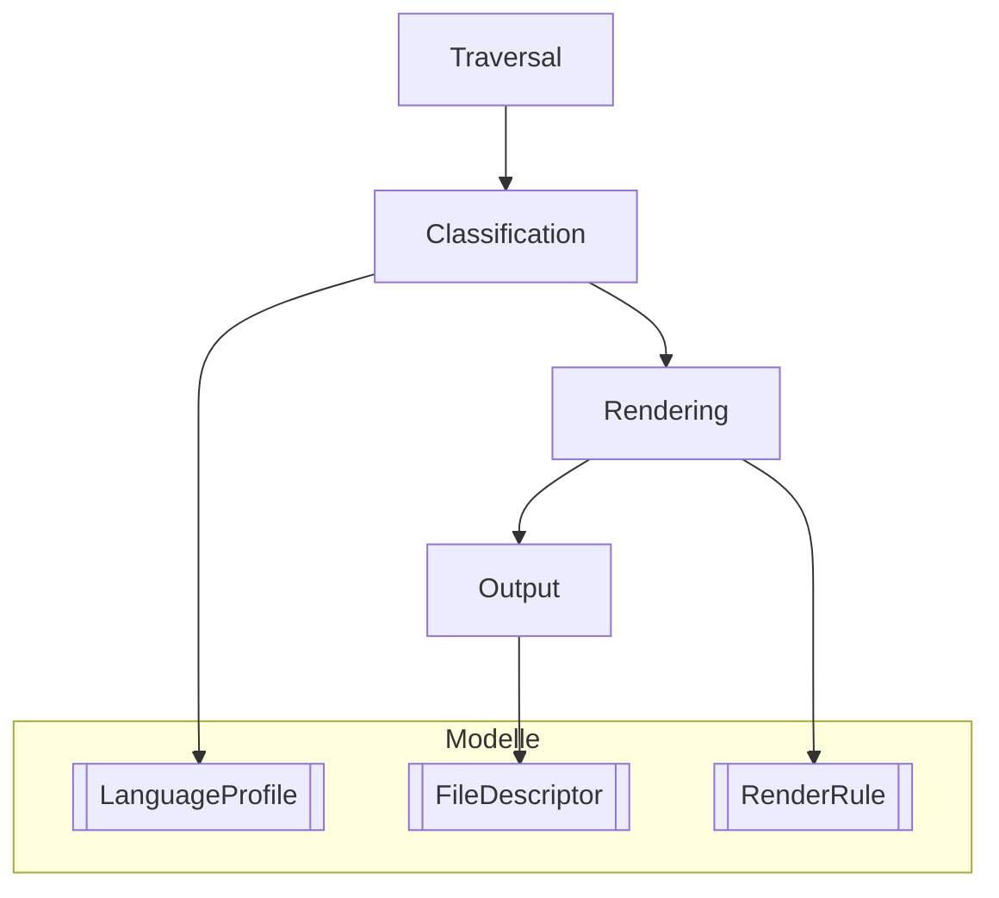
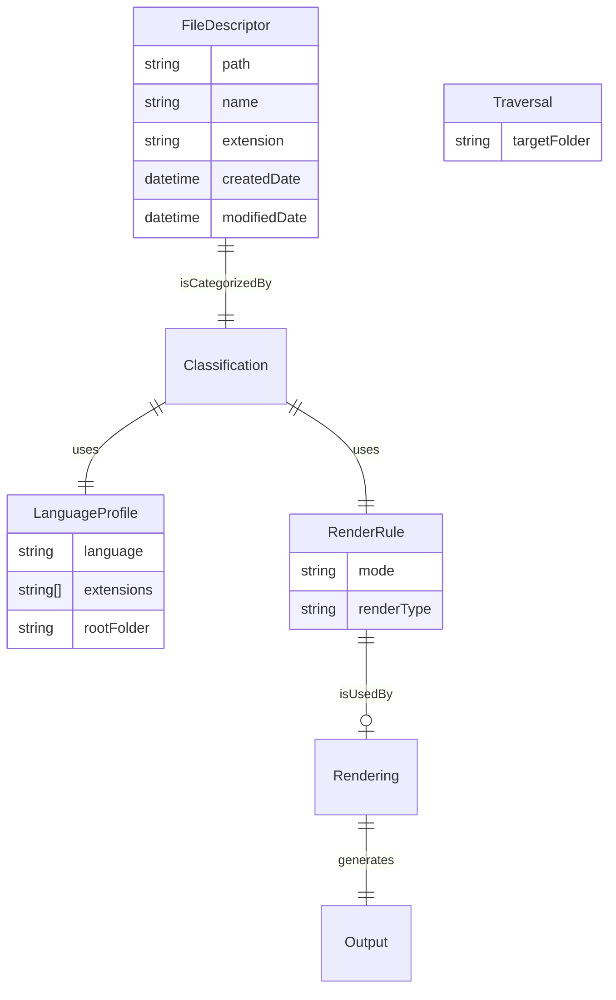

# Import-Your-Code (Obsidian Plugin)

## Ausgangslage & Motivation
---
### Motivation
Ich verwende Obsidian als zentrales Nachschlagewerk für Programmierwissen. Problematisch dabei sind wiederkehrende Herausforderungen:

„Verwaiste Dateien“ (Orphans im GraphView).
Eine konsistente Ordnung für Quellcode.
Automatisierte Übersichtsseiten ohne Mehraufwand.
Dieses Plugin wurde ursprünglich als einfache Erweiterung gebaut, um kleine Projekte automatisch in Obsidian sichtbar zu machen. 
Die Erfahrungen aus dem ersten Skript flossen in eine modularere Neuimplementierung, fokussiert auf nutzungsfreundliche Erweiterbarkeit und höhere Stabilität.

### Für wen ist Das Plugin geeignet?

Die Idee ist entstanden durch meine Ausbildung, in der ich viele kleine Programme mit gezielten UseCases geschrieben habe. 
Da ich Obsidian als mein Nachschlagewerk nutze, kam der Wunsch, Aufgabenorientiert nach meinen erstellten Programmen zu suchen und zu betrachten, doch erlaubt Obsidian dies nicht immer. (z.B .h files)

Durch die Menge an Projekten und files wurde das hereinkopieren der einzelnen Files in Codeblöcken zu umständlich und ich suchte nach einer lösung, das gesammte Programm in meinen Vault zu integrieren und einzubinden, ohne grossen mehraufwand, so ist das erste Plugin entstanden. Dieses ist jedoch schnell an seine Grenzen gekommen, weshalb ich mich entschloss - ohne weiteres gebastel - von Grund auf neu zu beginnen. 

Falls Sie zufällig über dieses Repo stossen und ähnliche Wünsche haben, könnte dieses tool - wenn es fretig ist - etwas sein. 

### Überblick

**Import-Your-Code** ist ein Obsidian-Plugin zur automatisierten Indexierung und Darstellung von Projektdateien innerhalb eines Vaults.
Es ist die **konzeptionelle und architektonische Weiterentwicklung** des ursprünglichen Skripts
[`obsidian-auto-import`](https://github.com/ElodinderBarde/obsidian-auto-import).

Während das Skript als **einmaliges, imperatives Hilfsmittel** gedacht war, verfolgt dieses Plugin einen **strukturierten, erweiterbaren und benutzerkonfigurierbaren Ansatz**.

---

###  IST-Zustand (aktueller Stand)

#### Herkunft & Basis

Der aktuelle Stand bildet den **funktionalen Kern** des ursprünglichen Skripts ab:

* rekursive Dateierfassung
* Klassifikation nach Sprache / Ordner
* Markdown-basierter Output
* Wikilinks als kleinster gemeinsamer Nenner

Das ursprüngliche Skript diente dabei als **Referenz für das gewünschte Endlayout und Verhalten**, nicht als Code-Vorlage.


### Aktuelle Architektur

Das Plugin ist **modular aufgebaut** und trennt klar zwischen den folgenden Hauptkomponenten:



#### **Hauptkomponenten:**
1. **Traversal**  
   Erfassen aller Dateien im Zielordner (rekursiv).
2. **Classification**  
   Zuordnung von Dateien zu Kategorien anhand von:
   - Root-Ordnern
   - Dateiendungen
   - Konfigurierbaren Sprachprofilen
3. **Rendering**  
   Entscheidung, *wie* eine Datei dargestellt wird (z. B. als Link, Embed, Asset oder übersprungen).
4. **Output**  
   Erzeugung strukturierter Markdown-Sections.

---

#### **Zentrale Modelle:**
- **`FileDescriptor`**  
  Repräsentiert jede Datei im Zielbereich (inkl. Pfad und Metadaten).
- **`LanguageProfile`**  
  Definiert:
  - Projekt-/Sprachkontext
  - Root-Ordner
  - Regeln pro Dateityp
- **`RenderRule`**  
  Einheitliche Darstellungsvorschrift über ein explizites Zustandsmodell:
  ```ts
  mode: "link" | "embed" | "asset" | "skip"
  ```

---

**Erläuterung des Datenflusses:**
1. **Traversal** führt eine rekursive Dateierfassung durch.
2. Die erfassten Dateien werden in **Classification** kategorisiert.
3. In **Rendering** wird für jede Kategorie entschieden, wie diese visualisiert wird.
4. **Output** erzeugt auf Basis der gerenderten Daten die strukturierten Markdown-Bereiche.

Dieses modulare Design ermöglicht eine klare Trennung der Logik und eine einfache Erweiterbarkeit des Plugins.


**Entity-Relationship-Modell (ER-Modell):""



Erläuterung des ER-Modells:

FileDescriptor: Beschreibt eine Datei mit Attributen wie path, name, und Metadaten (createdDate, modifiedDate).
LanguageProfile: Beschreibt die Konfiguration für eine Programmiersprache (z. B. unterstützte Dateiendungen und der Root-Ordner).
RenderRule: Definiert, wie eine Datei gerendert werden soll (z. B. als Link, Embed, Asset oder übersprungen).
Traversal: Der Startpunkt des Plugins; definiert, welcher Ordner rekursiv untersucht wird.
Beziehungen:
FileDescriptor wird in der Classification kategorisiert.
Classification nutzt LanguageProfile und RenderRule, um Dateien zuzuordnen und Render-Entscheidungen zu treffen.
Rendering nutzt die RenderRule, um die Dateien für den Output vorzubereiten.
Der Output wird letztlich durch die gerenderten Daten generiert.
---


#### Aktueller Funktionsumfang

✔ Alle Dateien werden erfasst
✔ Jede Datei ist **mindestens als Wikilink darstellbar**
✔ Klassifikation ist **regelbasiert und erweiterbar**
✔ Code kompiliert sauber
✔ Fundament für Mehrprojekt-Support ist gelegt

⚠ Noch nicht aktiv nutzbar im Obsidian-UI

⚠ Renderer bildet das alte Layout noch nicht vollständig nach

⚠ Settings-UI ist noch leer

---

### SOLL-Zustand (Zielbild)

#### Zielsetzung

Das Plugin soll **alles leisten, was das ursprüngliche Skript nicht konnte**, ohne dessen Einfachheit im Default-Fall zu verlieren.

Der **Base-Zustand** soll dem ursprünglichen Script entsprechen:

* Standard-Root: `Quellcode`
* automatische Indexierung
* sofort nutzbarer Markdown-Output

Darüber hinaus soll das Plugin **erweiterbar, personalisierbar und zukunftssicher** sein.

---

#### Geplante Funktionen

#####  Konfiguration & Erweiterbarkeit

* Benutzer können:

    * neue Sprachen / Profile hinzufügen
    * Regeln pro Dateityp definieren
    * Darstellungsmodi anpassen
* Keine Hardcodierung von Sprachen oder Extensions
* Konfiguration über Plugin-Settings (persistiert im Vault)

#####  Mehrere Projekte

* Erkennung mehrerer Projektstrukturen innerhalb eines Vaults
* Separate Root-Ordner pro Projekt
* Saubere Trennung der Ausgabe

#####  Rendering & Layout

* Nachbildung des ursprünglichen Skript-Layouts als Default
* Optionale Layout-Anpassungen:

    * Section-Titel
    * Gruppierungslogik
    * Darstellung pro Dateityp
* Vorbereitung für zukünftige Renderer (z. B. Tabellen, Codeblöcke)

#####  Vollständige Indexierung

* **ALLE Dateien werden indexiert**
* Auch nicht darstellbare Formate erscheinen:

    * als Wikilink
    * oder als Asset-Referenz
* Keine „stillen Auslassungen“

#####  Zukunftssicherheit

* Render-Modell ist explizit (`RenderMode`)
* Neue Modi können ergänzt werden, ohne bestehende Logik zu brechen
* Grundlage für:

    * Encoding-Sonderfälle
    * Assets
    * externe Ressourcen

---

### Abgrenzung zum ursprünglichen Skript

| Aspekt             | Skript       | Plugin       |
| ------------------ | ------------ | ------------ |
| Architektur        | monolithisch | modular      |
| Erweiterbarkeit    | nein         | ja           |
| User-Konfiguration | nein         | ja           |
| Mehrprojekte       | teilweise    | geplant      |
| Rendering          | fix          | regelbasiert |
| Wartbarkeit        | begrenzt     | hoch         |


