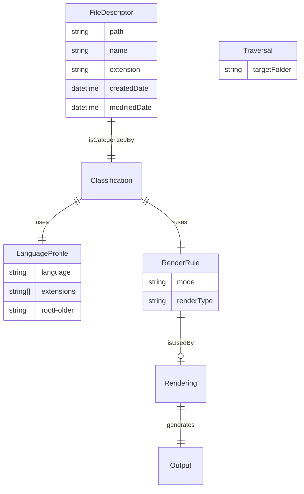

# Import-Your-Code (Obsidian Plugin)

## Situation & Motivation
---

### Motivation
I use Obsidian as a central repository for programming knowledge. However, there are recurring challenges:

- "Orphaned files" (orphans in GraphView).  
- Consistent organization of source code.  
- Automated overview pages without additional effort.  

This plugin was originally built as a simple extension to make small projects automatically visible in Obsidian. The experiences gained from the first script were incorporated into a more modular redesign, focusing on user-friendly extensibility and improved stability.

---

### Who Is This Plugin For?
The idea for this plugin arose during my training, where I wrote many small programs with specific use cases. Since I use Obsidian as my knowledge base, I wanted to search and view my created programs based on tasks. Unfortunately, Obsidian doesn’t always support this—like `.h` files, for example.

Due to the large number of projects and files, copying individual files into code blocks became too cumbersome, and I looked for a solution to integrate entire programs into my Vault without much additional effort. This led to the development of my first plugin. However, it quickly met its limitations, which led me to decide—without further tinkering—to start fresh from the ground up.

If you just happened to stumble upon this repository and share similar needs, this tool—when finished—might be something useful for you, as soon as its finished.

---

### Overview

**Import-Your-Code** is an Obsidian plugin for the automated indexing and presentation of project files within a Vault.  
It is the **conceptual and architectural evolution** of the original script [`obsidian-auto-import`](https://github.com/ElodinderBarde/obsidian-auto-import).

While the script was designed as a **one-off, imperative tool**, this plugin follows a **structured, extensible, and user-configurable approach**.

---

### Current State (IST)

#### Origin & Basis
The current state represents the **functional core** of the original script:

- Recursive file collection.  
- Classification by language and folder.  
- Markdown-based output.  
- Wikilinks as the smallest common denominator.

The original script served as a **reference for the desired layout and behavior**, but not as a code template.

---

### Current Architecture
The plugin is **modularly structured**, clearly separating the following main components:


---

#### **Main Components:**
1. **Traversal:**  
   Collects all files in the target folder recursively.  
2. **Classification:**  
   Assigns files to categories based on:  
   - Root folders.  
   - File extensions.  
   - Configurable language profiles.  
3. **Rendering:**  
   Determines how a file is presented (e.g., as a link, embed, asset, or skipped).  
4. **Output:**  
   Creates structured Markdown sections.

---

#### **Key Models:**
- **`FileDescriptor`:**  
  Represents each file in the target area (including path and metadata).  
- **`LanguageProfile`:**  
  Defines:  
  - Project/language context.  
  - Root folders.  
  - Rules for each file type.  
- **`RenderRule`:**  
  Uniform rendering guideline with an explicit state model:  
  ```ts
  mode: "link" | "embed" | "asset" | "skip"
  ```

---

#### **Data Flow Explanation:**
1. **Traversal** performs recursive file collection.  
2. The collected files are categorized in **Classification**.  
3. **Rendering** decides how each category is visualized.  
4. **Output** generates structured Markdown based on the rendered data.

This modular design enables clear logical separation and makes the plugin easily extensible.

---

### Entity-Relationship Model (ER-Model):



**Model Explanation:**
- **FileDescriptor:** Describes a file with attributes like `path`, `name`, and metadata (`createdDate`, `modifiedDate`).  
- **LanguageProfile:** Describes configuration for a programming language (e.g., supported file extensions and root folder).  
- **RenderRule:** Defines how a file should be rendered (e.g., as a link, embed, asset, or skipped).  
- **Traversal:** The starting point of the plugin; defines which folder is scanned recursively.  

**Relationships:**
- `FileDescriptor` is classified by `Classification`.  
- `Classification` uses `LanguageProfile` and `RenderRule` to categorize files and make rendering decisions.  
- `Rendering` uses `RenderRule` to prepare files for the `Output`.  
- The `Output` is ultimately created based on rendered data.

---

### Current Functionality
✔ All files are collected.  
✔ Each file is **at least presented as a Wikilink**.  
✔ Classification is **rule-based and extensible**.  
✔ Code compiles cleanly.  
✔ Foundation for multi-project support is laid.

⚠ Not yet usable in the Obsidian UI.  
⚠ Renderer does not fully replicate the old layout.  
⚠ Settings-UI is still empty.

---

### Future Goals (SOLL)
#### Goal
The plugin aims to achieve **everything the original script could not**, while retaining its simplicity in the default case.

The **base state** should mirror the original script:  
- Standard root folder: `Quellcode`.  
- Automatic indexing.  
- Immediately usable Markdown output.

Beyond this, the plugin should be **extensible, customizable, and future-proof**.

---

#### Planned Features

##### Configuration & Extensibility:
- Users can:  
  - Add new languages/profiles.  
  - Define rules per file type.  
  - Adjust rendering modes.  
- No hardcoding of languages or extensions.  
- Configuration through plugin settings (persisted in the Vault).

##### Multiple Projects:
- Detection of multiple project structures within a Vault.  
- Separate root folders per project.  
- Clean separation of outputs.

##### Rendering & Layout:
- Reproduction of the original script layout as the default.  
- Optional layout adjustments:  
  - Section titles.  
  - Grouping logic.  
  - Presentation per file type.  
- Preparation for future renderers (e.g., tables, code blocks).

##### Complete Indexing:
- **ALL files** are indexed.  
- Non-renderable formats also appear:  
  - As Wikilink.  
  - Or as asset reference.  
- No "silent omissions."

##### Future Proofing:
- Render model is explicit (`RenderMode`).  
- New modes can be added without breaking existing logic.  
- Foundation established for:  
  - Encoding special cases.  
  - Assets.  
  - External resources.

---

### Comparison with the Original Script

| Aspect             | Script       | Plugin       |
| ------------------ | ------------ | ------------ |
| Architecture        | Monolithic   | Modular      |
| Extensibility       | No           | Yes          |
| User Configuration  | No           | Yes          |
| Multi-projects      | Partial      | Planned      |
| Rendering           | Fixed        | Rule-based   |
| Maintainability     | Limited      | High         |

--- 

Let me know if further refinements are needed!
